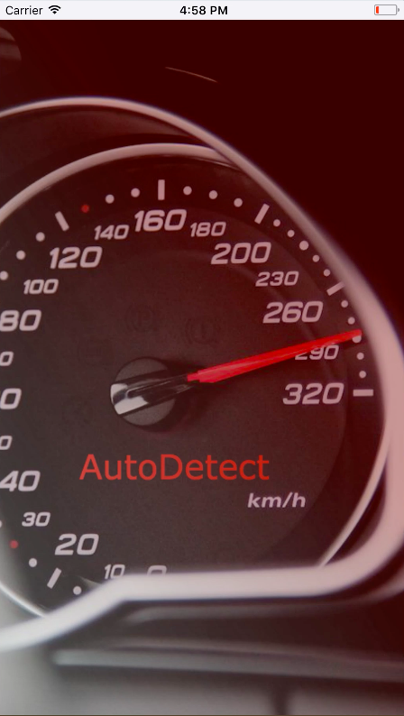

# AutoDetect  
As many Germans, I have always been really into cars and Formula1. I always wanted to be able to create a mobile prototype using machine learning techniques. Eventually, I want to create a platform which makes it easy to get offers and information about a car you see on the street by taking a photo of it.

So for my final project, I wanted to combine my little experience in iOS development with my knowledge I acquired over the last 12 weeks. My goal for this project was to create an real world application that makes it easy to find out the make, model and average price of a used car.  
For building the underlying technology, I used a method within the Deep Learning space called transfer learning. A common task is to first train an image classification model with the ImageNet Challenge data set, and then transfer this model’s knowledge to a distinct task.  

 

I chose to use the pre-trained neural network InceptionV3 as a base model, extend it with my own neural network and fine tune it on about 170,000 car images from over 60,000 cars on eBay Motors.

  

After preparing, processing and cleaning my data I used Keras to build my image classification model. Instead of using all of Inception classes - 1,000 objects classes (trees, people, animals, etc.) - I used a total of 468 car models /classes.  

Not surprisingly, the model performed very poorly in the beginning since I started out with a huge imbalance in classes. In other words, I didn’t have enough images of car models which weren’t as popular and I had too many images of popular cars. After solving several problems including class imbalance, underfitting and struggling performance, I was able to push my model to classify over 468 car models with an accuracy of 90/80% on my training/validation set. Over 90% of the times the right prediction is in the Top 3.  

  

To put this technology to use I created an iOS 11 app with Swift and Apple’s new machine learning library, CoreML (released at the beginning of June), which makes it easy to convert Keras models and use them in the iOS environment.
Here’s a little demo of the app on youtube:

Next Steps:  
I am able to release this app in the next release iOS 11 this fall. Until then, I want to include price averages, show location-based offers of used cars and improve the interface of the app. If you want to look at my code and get more information, visit my <a href="http://www.github.com/Flowinger/AutoDetect">GitHub repo</a>.  

  

